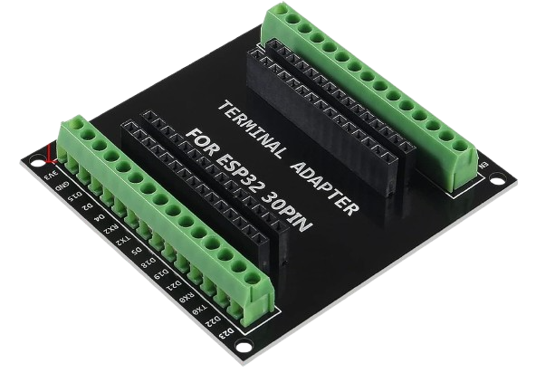
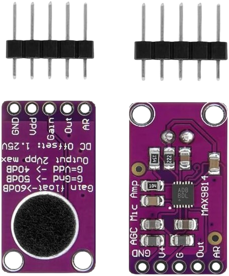
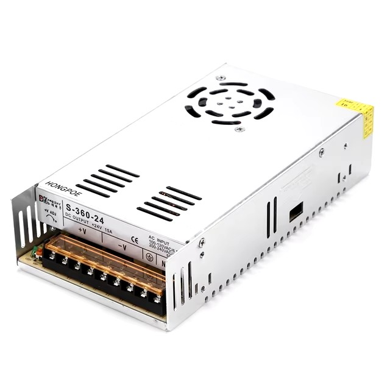
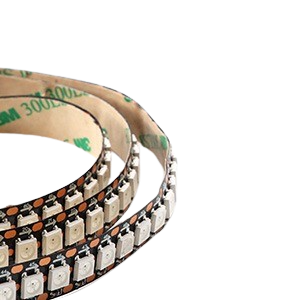
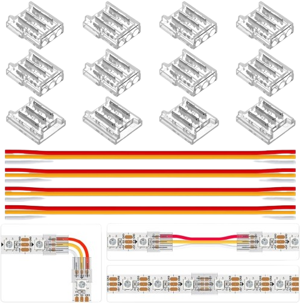
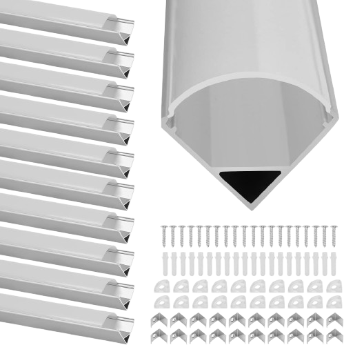
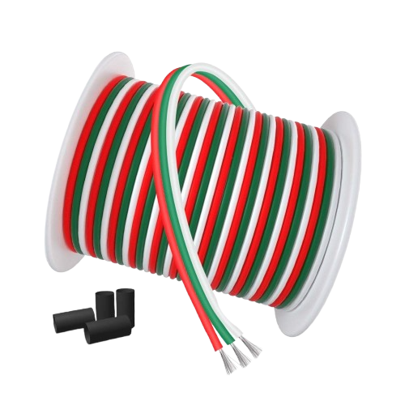
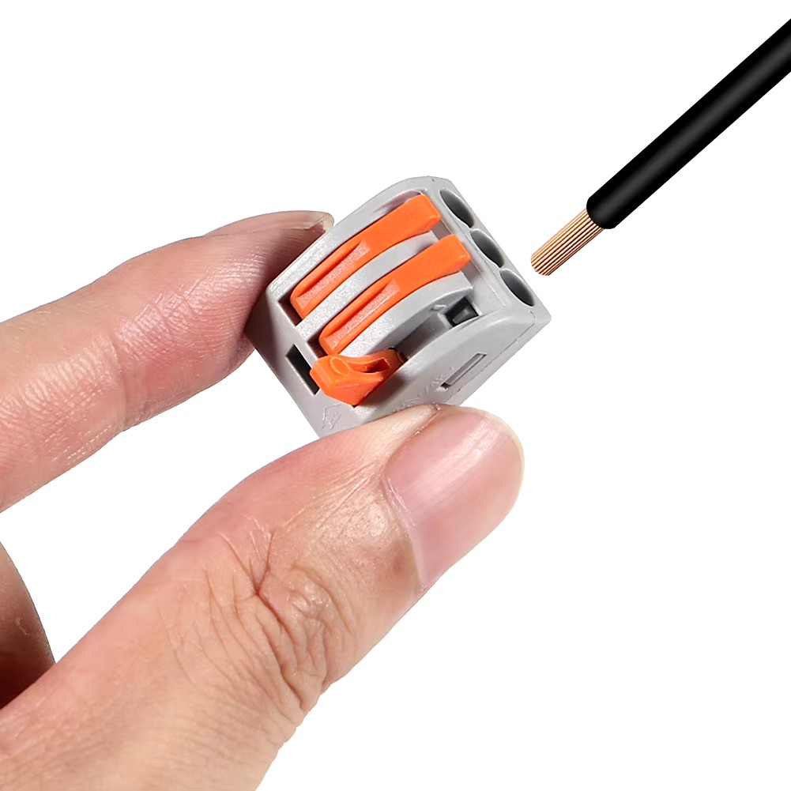

<h1 align="center"><strong>🔉🔉WLED SoundReactiv интилигентна цветомузика🔉🔉</strong></h1>

## 🔔Идея: 
Идеята е в ъглите на помещението да се сложат алуминиеви профили с LED ленти, които да извършват дейност при звук, паралелно, а не последователно. Схемата която съм изработил е едно към едно с това как съм свързал компонентите.:

:warning: На схемата не е показана дължината на лентата или броят на диодите, понеже това не е от значение.

- **Неоходими компоненти за проекта:**
    - **ESP32 DEV:** моделът не е от много голямо значение в този проект беше използван ["ESP32 WROOM-32 Entwicklungsboard TYPE-C CH340C/ CP2102" ](https://de.aliexpress.com/item/1005005953505528.html?spm=a2g0o.order_list.order_list_main.20.133b5c5fUUgTke&gatewayAdapt=glo2deu) 

    

    - **ESP32 Adapter:** Предимствата на този ["Terminal Adapter"](https://www.amazon.de/dp/B0CRVHJ9GB?ref=ppx_yo2ov_dt_b_fed_asin_title) са много, ето и някой от тях.:
        - Не е необходимо запояване, а всъщност е здраво и стъбилно.
        - Не се налага да програмирате ["ESP32 WROOM-32 Entwicklungsboard TYPE-C CH340C/ CP2102" ](https://de.aliexpress.com/item/1005005953505528.html?spm=a2g0o.order_list.order_list_main.20.133b5c5fUUgTke&gatewayAdapt=glo2deu) на място, а след програмирането просто го поставяте.
        - Възможност за тестване с повече от един чип (докато всичко си работи можете да си поиграете с настроиките върху др. чип и просто да ги размените).
        - Предотвратява допир на два пина.
        - Удобно за направата на мост между два пина.
        
         

        

    - **Микрофон:** [MAX9814](https://www.amazon.de/dp/B0D3X6K7BW?ref=ppx_yo2ov_dt_b_fed_asin_title) е идеалният избор за този проект, но той може да бъде заменен и с друг вид.:

        
        
        :warning: Преди да включите захранването се уверете че кабелите водещи до микрофонът са точно както на схемата най горе и не контактуват помежду си. В противен случай микрофонът изгаря и става негоден за употреба. Можете да проверите това с мултицет. Четирите канала на микрофона не трябва да контактуват, ако те контактуват търсете проблемът в споиките или вече той е изгорял. 

    - **Захранване:** то би могло да бъде и друго, в този проект ползвах ["vusum Schalt-LED-Netzteil, 5-V-Netzteil, Transformator"](https://de.aliexpress.com/item/1005005616440560.html?spm=a2g0o.order_list.order_list_main.4.133b5c5fQtV6NX&gatewayAdapt=glo2deu). 

        

        :warning:Да работи на 5 волта и мощността му да не е по-малка от тази на лед лентите които ще захранва. Както се вижда в обявата цената между 150W-350W не e много голяма. Моят съвет е да вземете максимално голямата мощност, понеже така или иначе ще изразходва само това което консумират LED-лентите а не повече.:

    - **LED лента:** за този проект избрах [Individually Addressable Led Strip,5m 300Pixels 5V Led](https://www.amazon.de/gp/product/B0BFWL445D/ref=ppx_yo_dt_b_search_asin_title?ie=UTF8&th=1).:

        

        :warning:Изборът на LED лента е строго идивидуален. В моят случай ми трябваха 4 ленти по 2,3 метра и избрах да закупе две ленти по 5 метра с максимален брой диоди на нея, за да се постигне максимален ефект.

        
    - **Други:** за проекта бяха нужни и [LED-конектори](https://www.amazon.de/gp/product/B094NJLKFH/ref=ppx_yo_dt_b_search_asin_image?ie=UTF8&psc=1) ,[кабели](https://www.amazon.de/gp/product/B08JTZKN4M/ref=ppx_yo_dt_b_search_asin_title?ie=UTF8&psc=1) ,[ъглови алуминеви профили](https://www.amazon.de/gp/product/B0BG8L6D8Q/ref=ppx_yo_dt_b_search_asin_title?ie=UTF8&psc=1) , [клемореди](https://de.aliexpress.com/item/1005006918394384.html?spm=a2g0o.order_list.order_list_main.151.133b5c5fQtV6NX&gatewayAdapt=glo2deu) 

        
        
        
        
    
